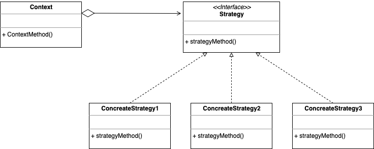
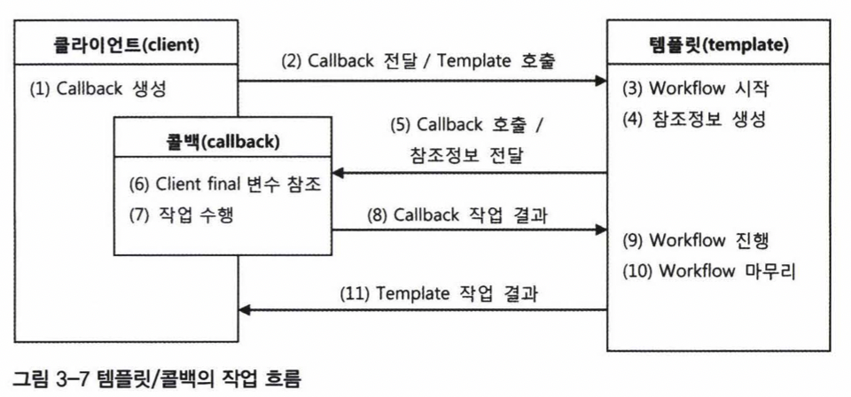

# 3장. 템플릿

## 3.1 다시 보는 초난감 DAO
- DB 커넥션은 어떤 예외가 발생하더라도 리소스를 다시 반환해야 한다.
- 예외 상황에서 리소스 반환하는 방법을 찾아야 한다.
- 대표적으로 아래의 코드를 보자. jdbc 수정에서 필요한 리소스는 2개가 있다. Connection과 PreparedStatement. 
```
public void deleteAll() throws SQLException
{
  Connection c = dataSource.getConnection();
  
  PreparedStatement ps = c.prepareStatement("delete from Users"); 
  ps.executeUpdate(); //예외가 발생 시 메소드 실행 중단이 된다.
  
  ps.close();
  c.close();
}
```
- 방금 전의 리소스인 Connection과 PreparedStatement는 풀 방식으로 운영된다.
  - **Connection pool**
  - **preparedstatement pool**


## 3.2 변하는 것과 변하지 않는 것
- 템플릿 메서드 패턴이란?


- 전략 패턴이란?



- 의존성주입을 위한 클라이언트/컨텍스트 분리


## 3.3 JDBC 전략 패턴의 최적화
- 중첩 클래스를 사용하는 방법
```
static class -> 독립적인 객체로 만들어질 수 있음
inner class //여기서는 이 내부 클래스를 사용했다. 그 중에서도 메서드 레벨에 정의되는 로컬 클래스
```
- 익명 내부 클래스를 활용하는 방법
```
익명 내부 클래스
new 인터페이스명() {클래스 본문}  
```
왜 이걸 쓸까? 클래스를 재사용할 필요가 없을 때 유용하다.

## 3.4 컨텍스트와 DI

## 3.5 템플릿과 콜백
- 템플릿과 콜백이란?
  - 어떤 목적을 이용해서 미리 만들어둔 모양이 있는 틀을 의미한다.
  - 콜백이란 실행되는 것을 목적으로 다른 오브젝트의 매소드에 전달되는 오브젝트를 의미한다.
  - 일례로 JSP(Java Server Page)는 HTML + EL이 추가된 템플릿 파일이다. (Java EE에서 사용가능)
 
- 템플릿과 콜백의 작업 과정을 살펴보자.
  1. 템플릿 내부에서 실행될 로직을 담은 콜백 오브젝트 생성, 콜백에서 참조할 정보를 제공한다.
  2. 콜백은 클라이언트와 템플릿에서 받은 정보를 이용해서 작업을 수행 후 템플릿에 돌려준다.
  3. 템플릿은 콜백의 정보를 이용해서 작업을 수행한다.

## 3.6 스프링의 JdbcTemplate
- update()  
- queryFont() 
- queryForObject()  
- query() 